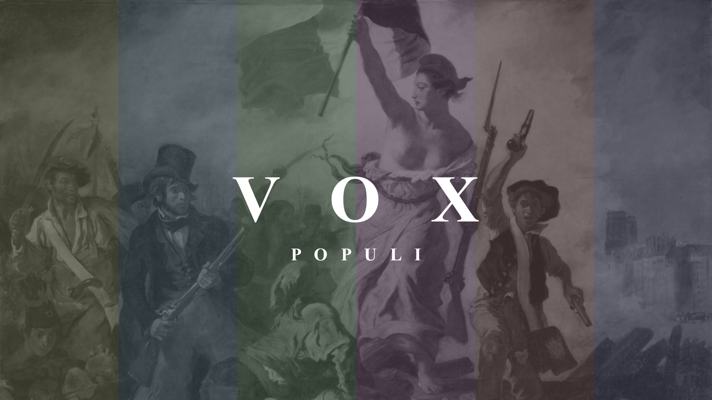

---

[vox populi](https://omega.gg/voxPopuli) is the first [tevolution channel](https://omega.gg/about/channel) on the Internet. 
It's designed to inform, educate and empower french citizens. 
It's a non profit initiative made by people for the people. 
vox populi is part of the [vox](https://omega.gg/vox/sources) tevolution network. 

## Access to vox populi

Scan or drop this VideoTag in a [Semantic Player](https://omega.gg/about/SemanticPlayer) like [MotionMonkey](https://omega.gg/MotionMonkey). 
Alternatively you can enter [omega.gg/voxPopuli](https://omega.gg/voxPopuli) in its search bar.

## Feeds

- [feed](playlist/feed.vbml): Feed of the recent videos broadcasted on vox populi.

## Authors

- Benjamin Arnaud aka [bunjee](https://bunjee.me) | <bunjee@omega.gg>
